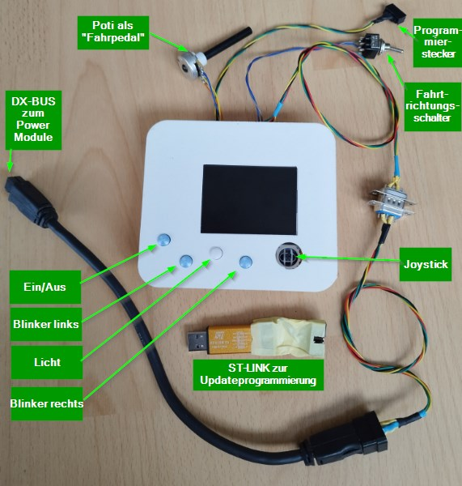

# DX-DASH Installations- und Bedienungsanleitung

## Verwendungszweck

Das DX-Bus-Dashboard (kurz: DX-DASH) in der Version "Generation 2, Software 2025-01-06" dient zur
Ansteuerung eines Motorsteuergerätes (Power Module DX-PMB-SAS) über den DX-BUS. Es ersetzt die
Busteilnehmer "Joystick-Modul" (UCM, Universal Control Module) und "Servo Lighting Module" (Steuergerät
für Lenkservo und Beleuchtung). 

## Installation

### DX-BUS

Das DX-DASH wird mit dem Power Module über den vierpoligen DX-BUS verbunden. Das Power Module liefert
auf dem DX-BUS permanent 24V. Das DX-DASH wird vom DX-BUS versorgt. Die Kommunikation und das
aufwecken / einschlafen läuft über die CAN-Leitungen vom DX-BUS.
Der DX-BUS wird am DX-DASH an folgenden Klemmen angeschlossen:

* 24V (Batterie plus, abgesichert im Power Module)
* GND (Batterie minus über Power Module)
* CANH (CAN-Bus, high)
* CANL (CAN-Bus, low)

### Beleuchtung

Das DX-DASH hat drei Leistungsausgänge zur Ansteuerung von Glühlampen: Blinker links, Blinker rechts und Fahrlicht.
Die Glühlampen werden zwischen 24V (entweder vom Akku über separate Sicherung, oder vom 24V-Anschluss des DX-BUS.
Die Leistungsausgänge sind im DX-DASH über selbstheilende Sicherungen mit ca. 3A abgesichert.
Die Klemmen am DX-DASH sind:

* OUT 1
* OUT 2
* OUT 3

### Fahrpedal

Das DX-DASH ermöglicht den Anschluss eines Fahrpedals, welches zwei unabhängige Potentiometer enthält.
In der aktuellen Version wird lediglich ein Potentiometer ausgewertet.
Das DX-DASH versorgt die Potentiometer mit 5V, und liest die Spannungen der Schleifer ein.
Das DX-DASH erwartet am Kanal 1 eine Spannung zwischen 1V (Pedal vollständig losgelassen) bis 4V (Pedal vollständig durchgetreten).
Die Klemmen am DX-DASH am Steckverbinder J10 sind:

* POT5V: 5V Versorgung für die Potis
* GND: Minusanschluss der Potis
* 1: Schleifer vom Poti 1
* 2: Schleifer vom Poti 2

### Fahrtrichtungsauswahl

Das DX-DASH liest einen Schalter ein, um die Fahrtrichtung (vorwärts/rückwärts) auszuwählen.

Der Schalter wird angeschlossen an:
* SWT1
* GND

### Software-Update

Zum Software-Update wird ein ST-LINK-Programmieradapter verwendet, um den Programmierstecker vom
DX-DASH mit einem USB-Anschluss des PCs zu verbinden.

Dateien zum Update sind auf Anfrage erhältlich.

Es gibt verschiedene Wege, das Update durchzuführen:

1. Kommandozeile: `$ ST-LINK_CLI -P dxdash-gen2.hex`. Das Tool ist enthalten z.B. in den STM32-Arduino-Tools, downloadbar von https://github.com/rogerclarkmelbourne/Arduino_STM32 über den Button "Code" und "Download ZIP". Nach dem Entpacken liegt es in Downloads/Arduino_STM32-master/Arduino_STM32-master/tools/win/stlink/st-link_cli.exe

2. Nutzeroberfläche: Die Installation ist hier beschrieben: https://www.st.com/en/development-tools/stsw-link004.html

Während des Updates muss der Einschaltknopf am DX-DASH dauerhaft gedrückt bleiben, um eine
durchgehende Spannungsversorgung sicherzustellen.
Falls ein Update fehlschlägt, ist das kein Problem. Es können problemlos weitere Updates (auf gleiche und andere
Software-Versionen) durchgeführt werden.

## Bedienung

- Ein- und Ausschalten: Linker Knopf
- Blinker links: unterer linker Knopf
- Blinker rechts: unterer rechter Knopf
- Fahrlicht: mittlerer Knopf
- Warnblinken: beide Blinkerknöpfe gleichzeitig drücken
- Fahren über Joystick: Joystick nach oben oder unten betätigen.
- Fahren über Fahrpedal: Fahrtrichtung mittels Fahrtrichtungsschalter auswählen und Fahrpedal betätigen
- Wechsel von Kriechgang zu Schnellgang: Joystick für eine Sekunde nach rechts betätigen
- Wechsel von Schnellgang zu Kriechgang: Joystick für eine Sekunden nach links betätigen

### Fehlermeldungen

Das DX-DASH zeigt Fehlermeldungen also roten Balken mit Fehlernummer und Fehlertext an.
Die meisten dieser Fehler erfordern zur Behebung einen Neustart. Dazu das DX-DASH ausschalten,
fünf Sekunden warten und wieder einschalten.

